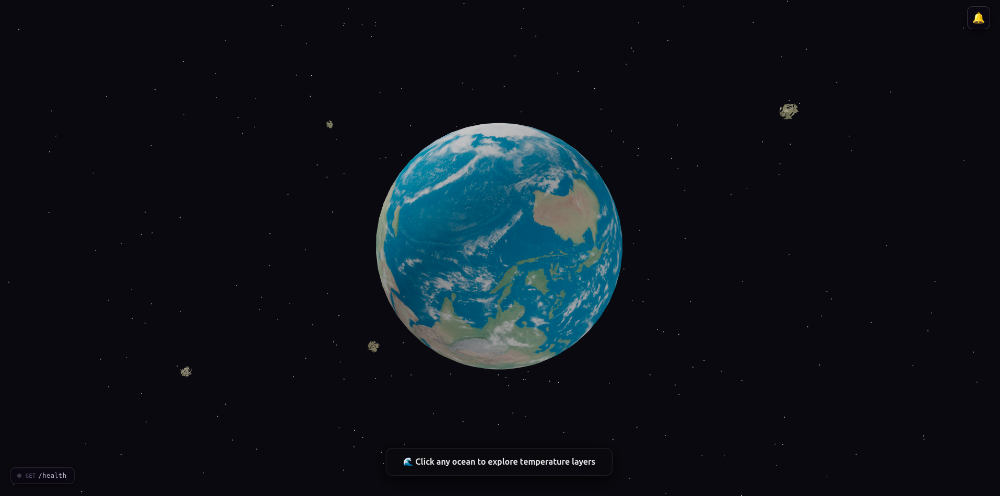

# OceanEmbed — Ocean Temperature Model

**Repo:** https://github.com/ashishk15678/Ocean-temperature-model

OceanEmbed reconstructs a 23-depth subsurface ocean-temperature profile at any point in the ocean from global satellite observations — sea-surface temperature (SST) and sea-surface height / sea-level anomaly (SSH/SLA) — using a ConvLSTM deep-learning model. The project has three parts:

| Part | Location | Purpose |
|---|---|---|
| **Backend** | `backend/` | FastAPI REST API that loads the model and satellite grids and serves predictions |
| **Frontend** | `frontend/` | React + Three.js 3D globe UI where a user clicks a point on Earth and sees a temperature-by-depth profile |
| **Training code** | `training-code/` | Jupyter notebooks and data used to train the ConvLSTM model |

---

## System Architecture


The frontend sends only `{ latitude, longitude, target_month }`. The backend does all the heavy lifting: loading satellite grids, preprocessing, running the model, and returning the 23-depth profile.

---

### Example :


---
## 1. How it works, end to end


1. The frontend renders an interactive 3D Earth (`react-three-fiber` + `three.js`). The user clicks a point on the globe and picks a target month.
2. The click position is converted to latitude/longitude (`geo.js`) and classified as ocean or land (`ocean-detection.js`).
3. The frontend sends **only** `{ latitude, longitude, target_month }` to the backend — never raw SST/SSH/ARGO data.
4. The backend:
   - Works out which monthly satellite files are needed for the requested month (`TemporalService`).
   - Loads and grids the SST and SSH NetCDF files for those months (`SSTRepository` / `SSHRepository`).
   - Fills missing values with saved training means and normalizes with saved training standard deviations (`Preprocessor`).
   - Runs one global ConvLSTM inference, producing a `180 × 360 × 23` global temperature field (`ModelService`).
   - Finds the nearest 1°×1° grid cell to the requested coordinates and extracts its 23-depth profile (`LocationService`).
5. The API returns the profile, and the frontend renders it as a 3D "core sample" of colored layers, one per depth.

**Note:** ARGO float data is used only for training/validation ground truth. It is not an inference input.

### Current prototype limitation

The shipped model, `prototype-v1`, was trained only on January–March 2020 data and can only predict **March 2020** (`SUPPORTED_TARGET_MONTHS=2020-03`). It is a proof of concept, not a general-purpose model. Swapping in a model trained on more months does not require API changes — only configuration changes (see [§4.6](#46-replacing-the-model)).

---

## 2. Repository layout

```text
Ocean-temperature-model/
├── public/                              README diagram images
│   ├── architecture.png
│   ├── request_flow.png
│   ├── model_tensor.png
│   ├── depth_profile.png
│   ├── color_scale.png
│   ├── data_pipeline.png
│   ├── alarm_system.png
│   └── ui_mockup.png
├── backend/
│   ├── app/
│   │   ├── main.py                      FastAPI app factory + startup wiring
│   │   ├── core/
│   │   │   ├── config.py                Settings (env-driven)
│   │   │   └── constants.py             Fixed grid/shape constants
│   │   ├── api/routes/
│   │   │   ├── health.py                GET /health
│   │   │   ├── model_info.py            GET /api/v1/model-info
│   │   │   ├── prediction.py            POST /api/v1/predict
│   │   │   ├── alarms.py                CRUD /api/v1/alarms
│   │   │   └── recipients.py            CRUD /api/v1/telegram-recipients
│   │   ├── schemas/
│   │   │   ├── prediction.py            Pydantic request/response models
│   │   │   └── alarm.py                 Alarm schema + status enum
│   │   ├── services/
│   │   │   ├── temporal_service.py      Target month → required input months
│   │   │   ├── model_service.py         Keras model load/inference boundary
│   │   │   ├── location_service.py      Coordinate normalization & profile extraction
│   │   │   ├── prediction_service.py    Orchestrates the full pipeline
│   │   │   ├── alarm_service.py         Poll loop + threshold checking
│   │   │   ├── telegram_service.py      Telegram Bot API wrapper
│   │   │   └── bot_service.py           Telegram /start command listener
│   │   ├── repositories/
│   │   │   ├── base.py                  Shared NetCDF grid reader
│   │   │   ├── sst_repository.py        SST-specific repository
│   │   │   ├── ssh_repository.py        SSH-specific repository
│   │   │   ├── alarm_repository.py      In-memory alarm store
│   │   │   └── recipient_repository.py  In-memory Telegram chat_id store
│   │   └── preprocessing/preprocessor.py  NaN-fill + normalization using saved stats
│   ├── model/                            Place the .keras model file here
│   ├── data/SST/, data/SSH/              Place monthly NetCDF grids here
│   ├── preprocessing_artifacts/          Place preprocessing_stats.npz here
│   ├── tests/                            Pytest suite (no TF/data required)
│   ├── requirements.txt
│   └── .env.example
├── frontend/
│   ├── src/
│   │   ├── App.jsx                       3D globe scene, click handling, depth-layer visualization
│   │   ├── AlarmPanel.jsx                Slide-in alarm management panel
│   │   ├── ocean-api.js                  Calls the backend (or mock data)
│   │   ├── ocean-detection.js            Classifies a click as ocean/land
│   │   ├── geo.js                        3D point → lat/lon conversion & formatting
│   │   ├── color-scale.js                Temperature → color mapping
│   │   ├── mock-data.js                  Mock API responses for local dev
│   │   ├── use-alarms.js                 Alarm CRUD hook + mock polling
│   │   ├── alarm-config.js               Depth labels + constants
│   │   └── config.ts                     Frontend configuration
│   └── public/                           Earth model (earth.glb), textures, Draco decoders
└── training-code/
    ├── noteBooks/                        Data download, preprocessing, and ConvLSTM training notebooks
    ├── models/                           Trained .keras artifacts
    └── ThreeMontProcessData/             Preprocessed training arrays
```

---

## 3. Model architecture and data contract


- **Input tensor:** `(1, 3, 180, 360, 2)` — batch of 1, 3 consecutive months (the temporal window), a 180×360 global 1° grid, and 2 channels.
- **Channels:** always `[SST, SSH/SLA]`, in that order. The model never sees latitude/longitude directly.
- **Output tensor:** `(1, 180, 360, 23)` — a full global temperature field at 23 fixed depths for every grid cell.
- **Depths (meters):** `30, 50, 75, 100, 125, 150, 200, 250, 300, 400, 500, 600, 700, 800, 900, 1000, 1100, 1200, 1300, 1400, 1500, 1750, 2000`.
- **Grid:** latitude centers run `-89.5 … 89.5`; longitude centers run `0.5 … 359.5` (1° spacing, `0..360` convention).

Coordinates are used only *after* the global prediction is produced, to select the nearest grid cell and slice out its 23-value profile.

### Example depth–temperature profile


### Temperature → color mapping

The frontend maps each depth's temperature to a color for the 3D layer visualization.


---

## 4. Backend (FastAPI)

### 4.1 Preprocessing pipeline


### 4.2 Install and run

Requires Python 3.10 or 3.11 (TensorFlow-compatible).

```bash
cd backend
python -m venv .venv
source .venv/bin/activate        # Windows: .venv\Scripts\activate
pip install -r requirements.txt
cp .env.example .env
uvicorn app.main:app --reload
```

- Interactive docs: `http://127.0.0.1:8000/docs` (Swagger) and `/redoc` (ReDoc)
- Health check: `GET /health`

Key dependencies (`requirements.txt`): `fastapi`, `uvicorn`, `pydantic` / `pydantic-settings`, `numpy`, `tensorflow`, `xarray`, `netCDF4`, `httpx`, `pytest`.

### 4.3 Required artifacts

| Artifact | Default path | Notes |
|---|---|---|
| Trained model | `model/ConvLSTM_JanFebMar_Prototype.keras` | Loaded once at startup via Keras |
| SST monthly grids | `data/SST/SST_YYYYMM*.nc` | Variable name `sst`, `analysed_sst`, or `sea_surface_temperature` |
| SSH monthly grids | `data/SSH/SSH_YYYYMM*.nc` | Variable name `sla`, `ssh`, `adt`, or `sea_level_anomaly` |
| Preprocessing stats | `preprocessing_artifacts/preprocessing_stats.npz` | Must contain scalar `sst_mean`, `sst_std`, `ssh_mean`, `ssh_std` from the **same training run** |

The preprocessing stats must come from training — they are never recalculated per request. Example of writing the artifact (with real trained values substituted in):

```python
import numpy as np
np.savez(
    "preprocessing_artifacts/preprocessing_stats.npz",
    sst_mean=YOUR_SST_MEAN, sst_std=YOUR_SST_STD,
    ssh_mean=YOUR_SSH_MEAN, ssh_std=YOUR_SSH_STD,
)
```

NetCDF files can use either `-180..180` or `0..360` longitude conventions and either `lat`/`lon` or `latitude`/`longitude` coordinate names — the repository layer (`app/repositories/base.py`) normalizes both automatically and reindexes onto the exact model grid (nearest match, tolerance 0.51°).

### 4.4 Configuration (`.env`)

All settings are defined in `app/core/config.py` (`pydantic-settings`, loaded from `.env`):

| Variable | Default | Meaning |
|---|---|---|
| `MODEL_PATH` | `model/ConvLSTM_JanFebMar_Prototype.keras` | Path to the `.keras` model file |
| `MODEL_VERSION` | `prototype-v1` | Reported in responses and `/health` |
| `SST_DATA_DIR` | `data/SST` | Directory of SST NetCDF files |
| `SSH_DATA_DIR` | `data/SSH` | Directory of SSH NetCDF files |
| `PREPROCESSING_STATS_PATH` | `preprocessing_artifacts/preprocessing_stats.npz` | Path to saved normalization stats |
| `ALLOW_ORIGINS` | `*` | Comma-separated CORS origins |
| `TEMPORAL_WINDOW_MONTHS` | `3` | Number of consecutive months the model consumes |
| `SUPPORTED_TARGET_MONTHS` | `2020-03` | Comma-separated allow-list; empty = allow any month with available input files |
| `REQUIRE_OCEAN_INPUT` | `true` | Reserved flag (currently informational) |
| `TELEGRAM_BOT_TOKEN` | *(empty)* | Set to enable Telegram alarm notifications |
| `INITIAL_CHAT_IDS` | *(empty)* | Comma-separated Telegram chat IDs to notify on startup |
| `ALARM_POLL_INTERVAL_SECONDS` | `2` | How often the alarm service polls predictions |

### 4.5 API reference

#### `GET /health`
Returns startup/model status.
```json
{ "status": "ok", "model_loaded": true, "model_version": "prototype-v1" }
```
`status` is `"unhealthy"` if the model failed to load.

#### `GET /api/v1/model-info`
Returns stable tensor metadata (never filesystem paths).
```json
{
  "model_version": "prototype-v1",
  "input_shape": [3, 180, 360, 2],
  "output_shape": [180, 360, 23],
  "input_channels": ["SST", "SSH/SLA"],
  "depths_m": [30, 50, 75, ..., 2000]
}
```

#### `POST /api/v1/predict`
Request body:
```json
{ "latitude": 20.5, "longitude": 75.5, "target_month": "2020-03" }
```
- `latitude`: `-90..90`
- `longitude`: `-180..360` (accepts either convention; normalized to `0..360` in the response)
- `target_month`: `YYYY-MM`, must be a real calendar month

Response:
```json
{
  "latitude": 20.5,
  "longitude": 75.5,
  "grid_latitude": 20.5,
  "grid_longitude": 75.5,
  "target_month": "2020-03",
  "depths_m": [30, 50, 75, ..., 2000],
  "temperature_celsius": [/* 23 model-generated values */],
  "model_version": "prototype-v1"
}
```

Example call:
```bash
curl -X POST http://127.0.0.1:8000/api/v1/predict \
  -H 'Content-Type: application/json' \
  -d '{"latitude":20.5,"longitude":75.5,"target_month":"2020-03"}'
```

**Error responses:**

| Situation | Status |
|---|---|
| Malformed request (bad lat/lon/month format) | `422 Unprocessable Entity` |
| `target_month` not in `SUPPORTED_TARGET_MONTHS` | `422 Unprocessable Entity` |
| Required satellite files missing for a needed month | `404 Not Found` |
| Requested cell is land / has no ocean data in any input month | `404 Not Found` |
| Model unavailable, preprocessing failure, or inference error | `503 Service Unavailable` |

#### `POST /api/v1/alarms` — create alarm
```json
{
  "latitude": 20.5, "longitude": 75.5, "target_month": "2020-03",
  "depth_index": 0, "condition": "above", "threshold_celsius": 27.0,
  "label": "warm surface alert"
}
```

#### `GET /api/v1/alarms` — list all alarms

#### `DELETE /api/v1/alarms/{alarm_id}` — remove alarm

#### `GET /api/v1/telegram-recipients` — list subscribed chat IDs
#### `POST /api/v1/telegram-recipients` — subscribe `{ "chat_id": "123456" }`
#### `DELETE /api/v1/telegram-recipients/{chat_id}` — unsubscribe

### 4.6 Backend internals (request lifecycle)

`PredictionService.predict()` orchestrates:
1. `TemporalService.required_months(target_month)` — computes the ordered list of months needed (e.g. `2020-03` with a 3-month window needs `["2020-01", "2020-02", "2020-03"]`), and rejects unsupported months.
2. `SSTRepository` / `SSHRepository` (`GridRepository` base class) — find and load each month's `.nc` file, reindex onto the fixed 180×360 grid.
3. `LocationService.nearest_grid_point()` — finds the nearest grid cell to the requested lat/lon.
4. A land/no-data check: if the target cell is `NaN` in **both** SST and SSH for **every** required month, the request fails with `InvalidOceanLocationError`.
5. `Preprocessor.build_tensor()` — fills `NaN`s with the saved training means, normalizes with the saved training standard deviations, and stacks into shape `(1, 3, 180, 360, 2)`.
6. `ModelService.predict()` — runs Keras inference and validates the output shape is `(1, 180, 360, 23)`.
7. `LocationService.extract_profile()` — slices the 23-depth profile at the target grid cell and validates all values are finite.

### 4.7 Replacing the model

The API contract (`POST /api/v1/predict` and its response schema) is designed to stay stable across model upgrades. To swap in a future model trained on more months:

```env
MODEL_PATH=model/OceanEmbed_v2.keras
MODEL_VERSION=oceanembed-v2
TEMPORAL_WINDOW_MONTHS=6
SUPPORTED_TARGET_MONTHS=
PREPROCESSING_STATS_PATH=preprocessing_artifacts/v2_stats.npz
```
This only works if the new model accepts a `(time, 180, 360, 2)` input for the new window length and still emits a `(180, 360, 23)` global output. If the tensor contract itself changes, update `ModelService`/`Preprocessor` while keeping the public API unchanged.

### 4.8 Tests

```bash
cd backend
pytest
```
Test files (`backend/tests/`): `test_health.py`, `test_prediction_schema.py`, `test_location.py`, `test_temporal_service.py`, `test_prediction_flow.py`. They use fakes/mocks and do **not** require TensorFlow, real NetCDF files, or a real `.keras` model.

---

## 5. Frontend (React + Three.js)


### 5.1 Install and run

```bash
cd frontend
npm install
npm run dev       # start dev server (Vite)
npm run build     # type-check + production build
npm run preview   # preview the production build
npm run lint       # eslint
```

Stack: **React 19**, **Vite**, **TypeScript**, **@react-three/fiber** + **@react-three/drei** (React renderer/helpers for `three.js`), **three.js** for the 3D globe, with Draco mesh compression assets under `public/draco/`.

### 5.2 Key modules

| File | Responsibility |
|---|---|
| `src/App.jsx` | Renders the 3D Earth (`earth.glb`), handles click-to-select on the globe, and builds an animated "core sample" of colored, wavy 3D layers — one per predicted depth — using the returned temperature profile |
| `src/AlarmPanel.jsx` | Slide-in panel for creating and managing temperature alarms |
| `src/geo.js` | Converts a clicked 3D world point into `{ lat, lon }` by undoing the globe's rotation and running spherical-to-geographic math; also formats coordinates/month for display |
| `src/ocean-detection.js` | Classifies a raycast hit as `'ocean'`, `'land'`, or `'unknown'` by matching mesh/material names against `OCEAN_KEYWORDS`/`LAND_KEYWORDS`, with an optional blue-hue color fallback |
| `src/ocean-api.js` | Sends `{ latitude, longitude, target_month }` to the backend (or returns mock data), validates the response shape, and throws a typed `OceanApiError` on failure |
| `src/use-alarms.js` | Alarm CRUD hook; polls mock profiles client-side in dev mode and calls backend `/trigger` so Telegram fires server-side |
| `src/color-scale.js` | Maps normalized temperature values to RGB/CSS colors for the depth-layer visualization |
| `src/mock-data.js` | Provides fake prediction responses for frontend development without a running backend |
| `src/config.ts` | Central frontend configuration (see below) |

### 5.3 Configuration (`src/config.ts`)

| Key | Default | Purpose |
|---|---|---|
| `DEBUG_MODE` | `true` | Enables console logging (e.g. clicked mesh names) |
| `USE_MOCK_DATA` | `true` (or `VITE_USE_MOCK_DATA` env var) | Use `mock-data.js` instead of a real backend call |
| `LONGITUDE_OFFSET` | `0` | Correction if the Earth texture is rotated relative to standard longitude |
| `OCEAN_KEYWORDS` / `LAND_KEYWORDS` | `['ocean','sea','water','deep']` / `['land','continent','terrain','earth','ground']` | Used to classify clicked meshes |
| `ENABLE_COLOR_FALLBACK` | `true` | Falls back to a blue-hue heuristic when name matching is inconclusive |
| `API_ENDPOINT` | `/api/v1/predict` (or `VITE_API_ENDPOINT`) | Backend prediction endpoint |
| `ALARM_POLL_INTERVAL_MS` | `2000` (or `VITE_ALARM_POLL_INTERVAL_MS`) | Alarm polling interval in mock mode |

To connect the frontend to a real backend instead of mock data, set:
```env
VITE_USE_MOCK_DATA=false
VITE_API_ENDPOINT=http://127.0.0.1:8000/api/v1/predict
```

### 5.4 User interaction flow (in `App.jsx`)

1. The user clicks a point on the rendered 3D Earth.
2. The raycast hit is classified via `classifyIntersection()`; non-ocean clicks are rejected/ignored.
3. `pointToLatLon()` converts the 3D hit point to latitude/longitude.
4. The camera smoothly zooms into the clicked point on the globe.
5. `fetchTemperatureProfile()` calls the backend (or mock data) with the coordinates and selected target month.
6. The 23 returned depth/temperature pairs are rendered as stacked, animated, organically-shaped 3D layers, colored by `temperatureToRGB()`/`temperatureToCSS()` based on a normalized temperature scale.
7. Depth labels (left) and temperature values (right) animate in alongside the layers.

---

## 6. Alarm & Notification System


Alarms let users monitor specific ocean coordinates and get notified when the predicted temperature at a given depth crosses a threshold.

### How alarms work

1. The user opens the alarm panel (bell icon, top-right) and fills in coordinates, depth, condition (`above`/`below`), and threshold.
2. The alarm is registered via `POST /api/v1/alarms` and gets a server-assigned ID.
3. **Real mode:** the `AlarmService` poll loop runs server-side every `ALARM_POLL_INTERVAL_SECONDS`, calls `PredictionService.predict()` for each active alarm, and fires Telegram if the threshold is crossed.
4. **Mock mode:** `use-alarms.js` polls `generateMockProfile()` client-side. When a threshold is crossed it calls `POST /api/v1/alarms/{id}/trigger` so the backend fires Telegram server-side even without real model data.

### Status transitions

| Status | Meaning |
|---|---|
| `active` | Condition not yet met — polling continues |
| `firing` | Condition currently met — Telegram + browser notification fired every cycle |
| `error` | Last poll threw an exception — retries automatically next cycle |

### Telegram setup

1. Create a bot via [@BotFather](https://t.me/BotFather) and copy the token.
2. Start a chat with your bot and send `/start`. The backend bot listener records your `chat_id`.
3. Set `TELEGRAM_BOT_TOKEN=<token>` in `backend/.env`.
4. Optionally pre-seed `INITIAL_CHAT_IDS=<chat_id1>,<chat_id2>` so notifications fire immediately on startup without needing `/start`.

---

## 7. Running the full stack locally

```bash
# Terminal 1 — backend
cd backend
python -m venv .venv && source .venv/bin/activate
pip install -r requirements.txt
cp .env.example .env
# put the model in model/, NetCDF grids in data/SST and data/SSH,
# and preprocessing_stats.npz in preprocessing_artifacts/
uvicorn app.main:app --reload

# Terminal 2 — frontend
cd frontend
npm install
echo "VITE_USE_MOCK_DATA=false" >> .env.local
echo "VITE_API_ENDPOINT=http://127.0.0.1:8000/api/v1/predict" >> .env.local
npm run dev
```

Then open the Vite dev server URL, click a point in the ocean on the 3D globe, and pick a supported month (`2020-03` for the shipped prototype) to see the predicted temperature-by-depth profile.

---

## 8. Training code (`training-code/`)

- `noteBooks/DownloadingDataSet.ipynb` — downloads the source SST/SSH/ARGO datasets.
- `noteBooks/LoadingAndVisualizingDataSets.ipynb` — loads and visualizes the raw satellite grids.
- `noteBooks/version01ConvoModelNoteBooks.ipynb` / `concoLSTMModel.ipynb` — build and train the ConvLSTM model.
- `models/ConvLSTM_JanFebMar_Prototype.keras` — the resulting prototype model artifact (same file used by the backend).
- `ThreeMontProcessData/` — preprocessed NumPy arrays used for the January–March 2020 training run (`Final_X_JanFebMar.npy`, `Final_Y_JanFebMar.npy`, `latitude.npy`, `longitude.npy`, `target_depths.npy`), plus `visualize.py` for inspecting them.

These notebooks are the source of both the `.keras` model file and the `preprocessing_stats.npz` values the backend depends on — any future retraining should re-export both artifacts together, since they must match.
